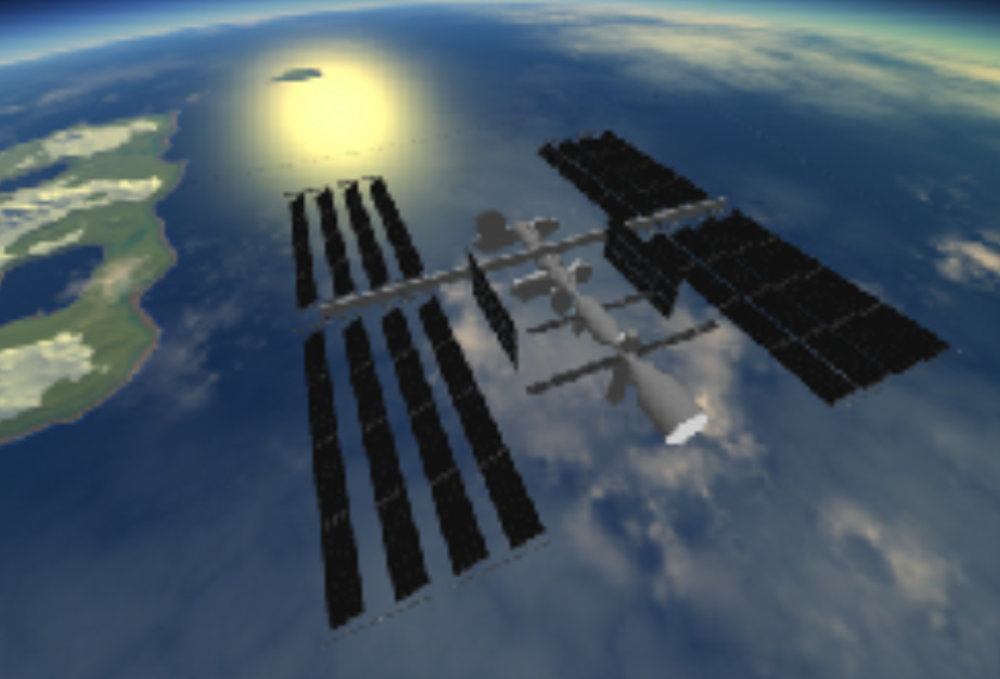

The model that I have built using hierarchical modeling is a replica of an International Space Station. It is made out of several objects built into one (as the ISS is a complex and large model by itself). 

The base of the station is built using modules. The modules are made by combining cylinders and circles to make the base cylinder and the ends of it and finally the circles to fill the holes in the module. The modules are then connected to each other in the way the real International Space Station is in real life. I tried to make it as realistic as possible within my time limit. 

The next are the solar panels which are all connected to either a supportive structure (which I have abstracted into a single cylinder due to it being a bit too complex in real life) or the base of the ISS. The big solar panels are connect to the big supportive structure at the top. The panels are modelled with rectangles as they are quite thin. 

The solar panels do change their position and rotation in real life. In my model, they change rotation for most of the panels. To make the scene look realistic, I have created a skybox with images of the earth in the orbit. The model itself is at the centre of the skybox and the sun is at the edge of it, shining light at the ISS.

The ISS is textured, but the base is mostly white as it is made mostly of white fabric or aluminium, so I made the base texture out of aluminium. The solar panels have the solar panel textures. The whole scene looks like the ISS is orbiting the earth and the player is floating above it.

To build the scene, I had a lot of trouble with transforming the modules so that they seem to connect with each other, but mostly it just took a lot of time to accurately portray the ISS. The texturing could be done a little better, but since the ISS model is highly abstracted and the real ISS has many details, it would have consumed a large amount of time to accomplish that. The skybox has edges for a reason that I have not figured out, so I assumed that it is a problem on the graphical end and not my own, since models made on Visual Studio did not have this problem.

