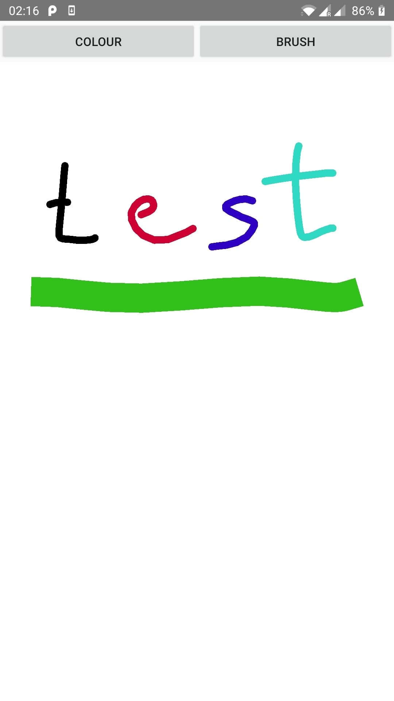
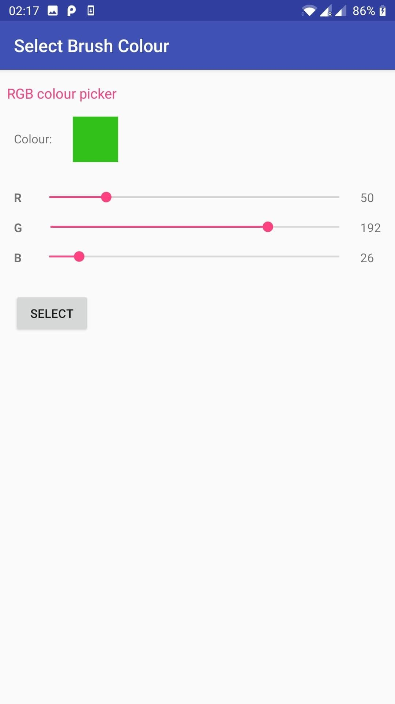
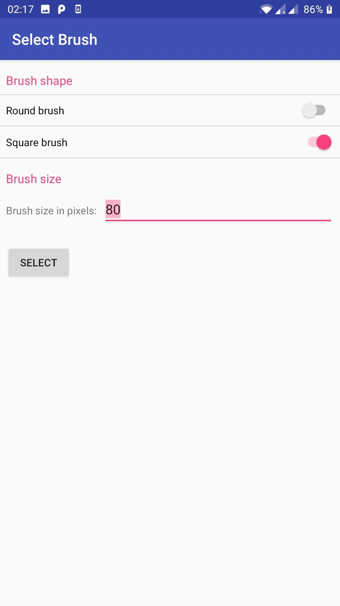
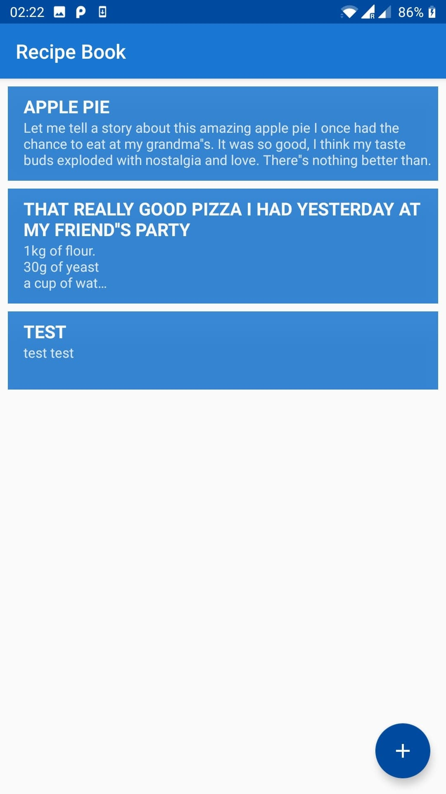
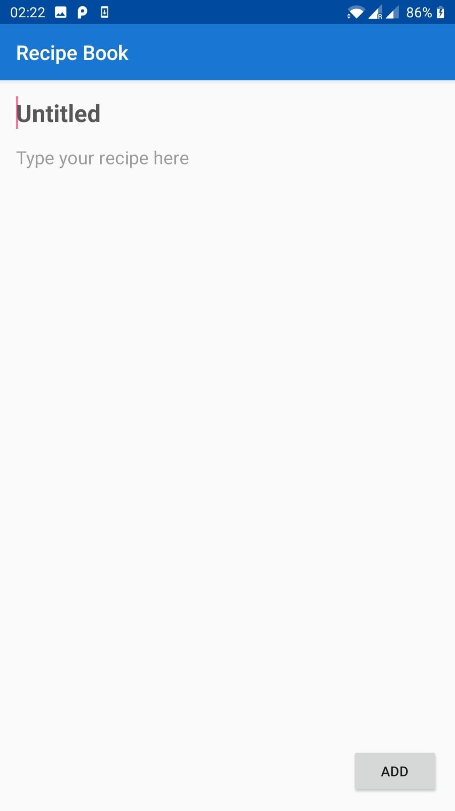
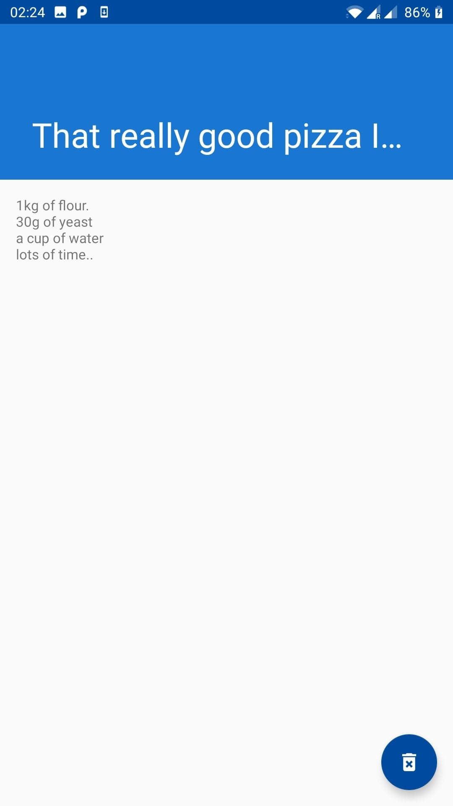

As part of the Mobile Device Programming module, I made 4 Android applications. Unfortunately I currently have lost access to the repositories projects were stored in except for the Running Tracker.

## Finger Paint App
The first app was the **Finger Paint**. It was a simple app that included a colour picker a canvas and a save/load picture feature. The purpose was to learn Android's activity lifecycle, passing of data via Intents.

<small> Screen captures of working paint app.</small>

## Notes App (Recipe Book)
The second app was the **Notes App**. It had features of writing a note, saving/loading and displaying existing notes. The purpose of this was to learn how to connect and use a database for the app.

<small> Screen captures of working note app.</small>

## Music Player App
The third app was the **Music App**. The application was able to play songs in the background, see and change the time of the song via the timeline, pause it and stop it. The purpose was to learn Android Services and Broadcast Receivers to have a long running process in the background, as well as notifications.

## Running Tracker App
The final app was the **Running Tracker**. The app tracks the user over GPS to display information about the user's run. It implemented a database, GPS provider, provider contract and a location service.
