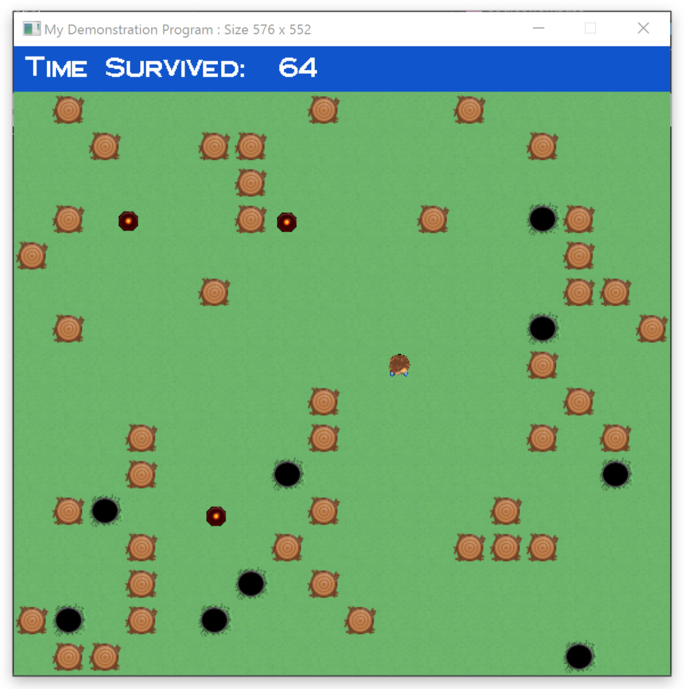

The project had been done as part of the C++ module coursework where I had to implement a simple game to demonstrate my abilities and knowledge of C++ and game programming, particularly C++ classes, polymorphism, game states, events, tile manager, graphics and I/O.

The program is a top to bottom 2D game, consisting of a movable player, randomly generated obstacles and enemies, and different game states.

