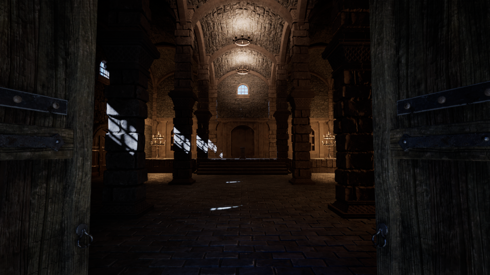
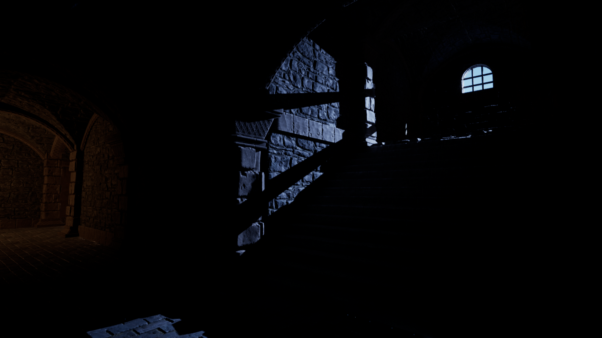
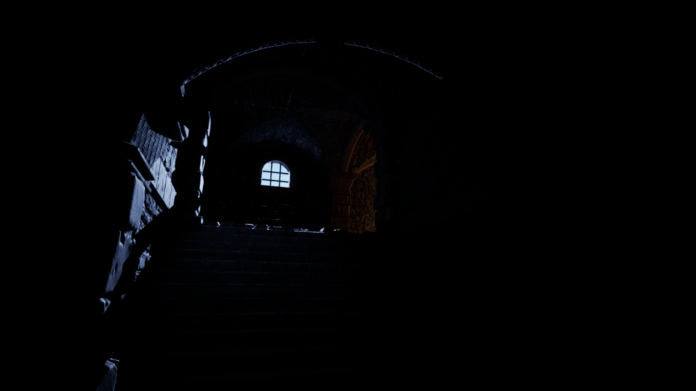
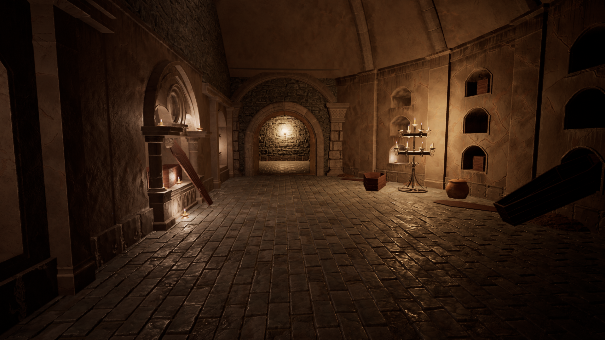
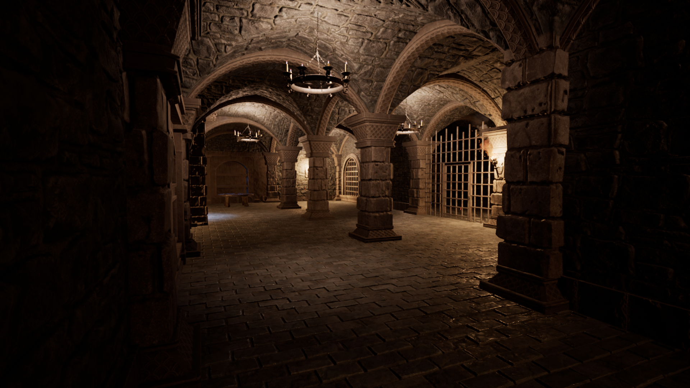
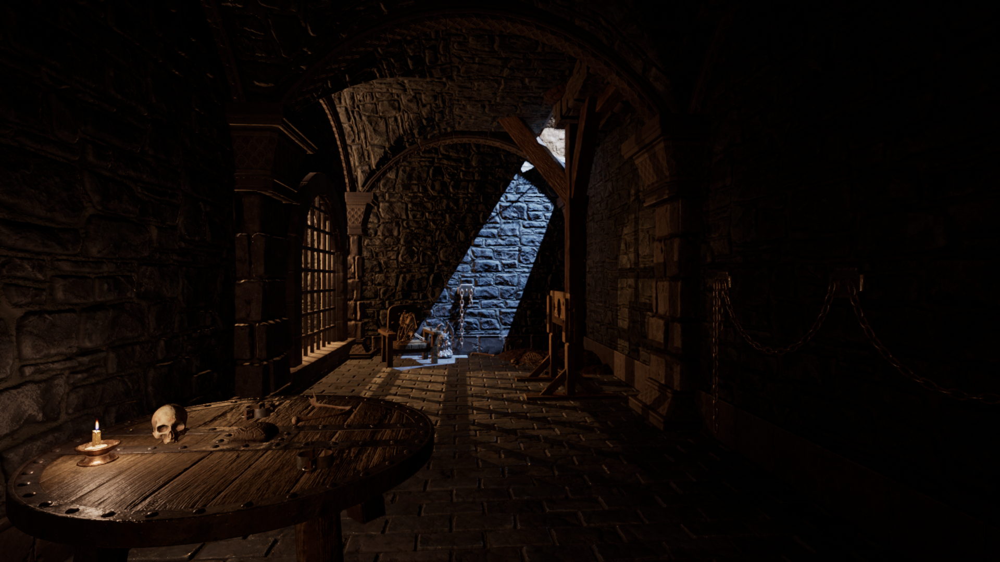
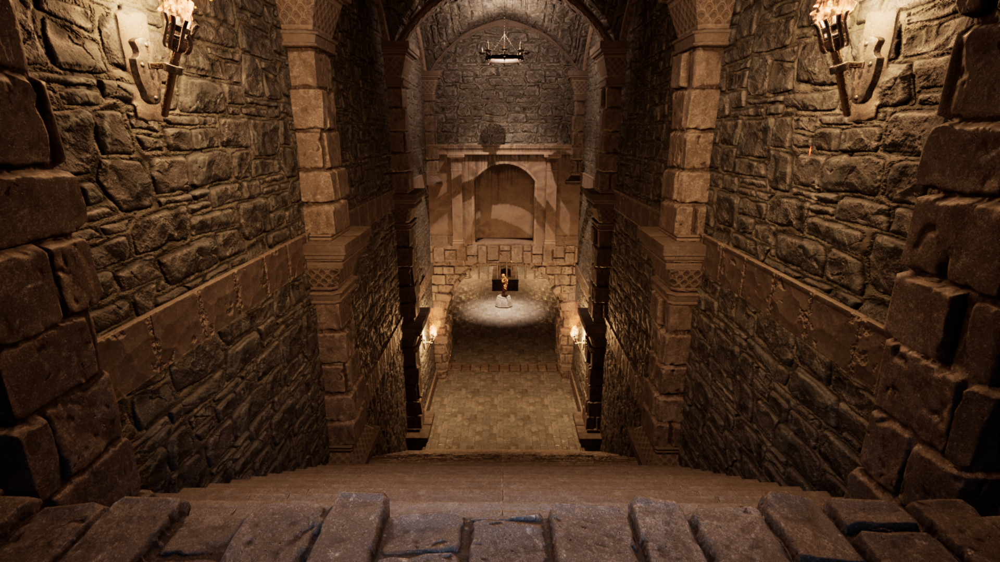
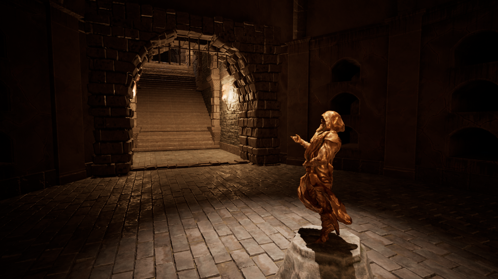
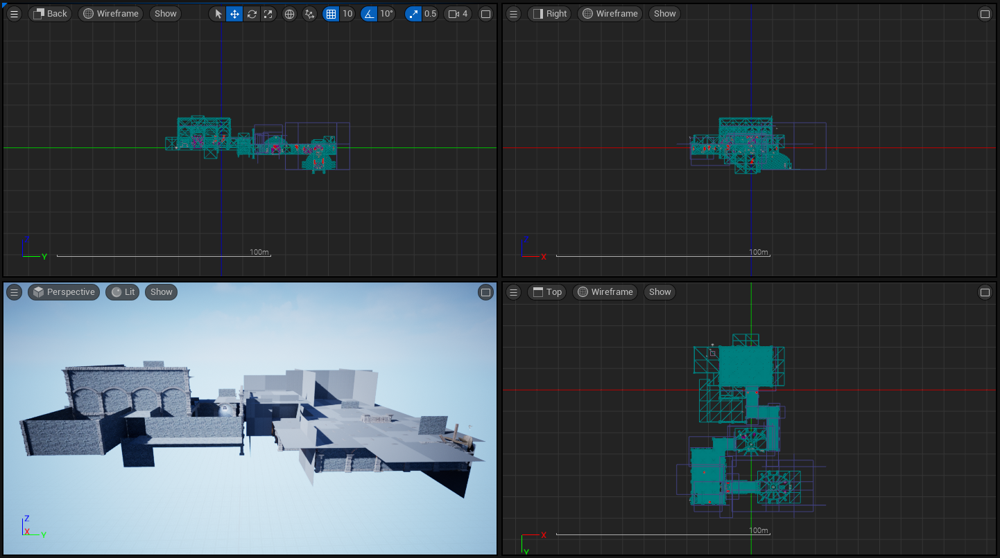

Crypt Raider is a game based on Gamedev.tv's course where the player has to raid a crypt to find treasure, which involves solving a puzzle.

The game has modular medieval assets that I used to design the level. The player can pick up objects, including keys and statues that unlock areas in the game, for example, unlocking a door with a key or placing a statue in place where it is missing to open a hidden passage.

## Showcase video



## Screenshots

#### #1

#### #2

#### #3

#### #4

#### #5

#### #6

#### #7

#### #8

#### Wireframe

