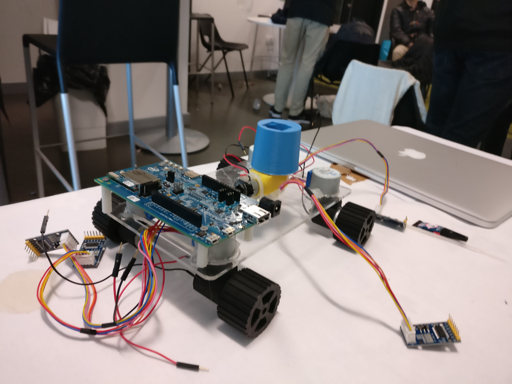

Over the Manchester hackathon, I had the opportunity to work with an Electrical Engineering student with whom we shared our interest for Arduino and embedded programming. The idea to build a robot came about due to our interest and the technology we were provided with at the hackathon. 

Initially, we wanted to work with Google's Project Tango device, which has a complex camera system to scan and 'understand' the environment in 3D world. The idea was to make a drivable robot with a gimbal attached to the scanner device which, over the internet, could be controlled. The purpose of this was to maybe gather and survey 3D information of buildings or difficult to access places. Another possible use was to allow the robot to maneuver in 3D space by itself.

<small>Photo of the robot in construction:</small>

Since we had access to a 3D printer, all of the parts were modeled and 3D printed. We used Intel Edison for the processor to connect and control the robot over the internet with the help of NodeJS.

The outcome was a robot that could be controlled with a keyboard, but the Tango idea was scratched due to the project being too complicated. Unfortunately, it was not able to drive around due to lack of batteries available during the hackathon.
