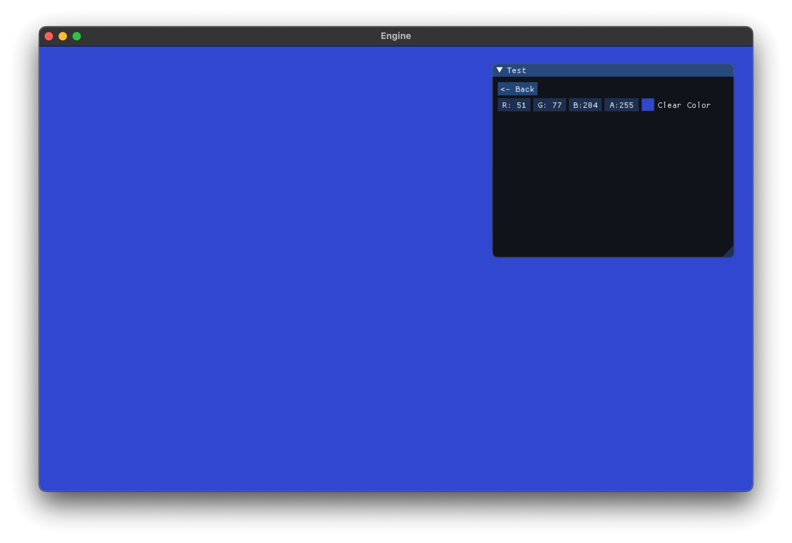
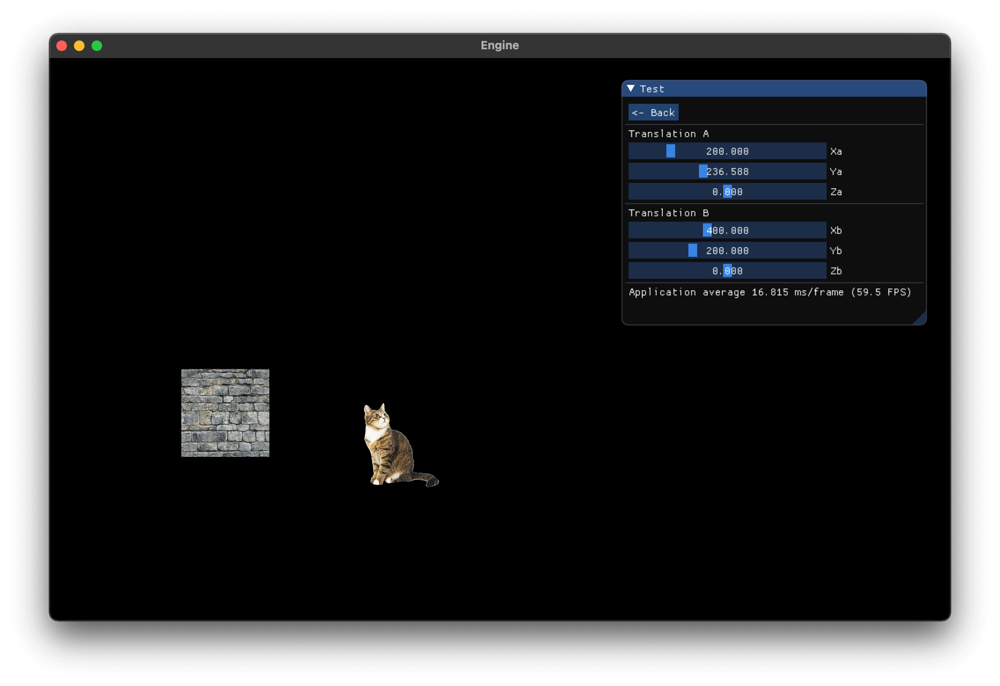
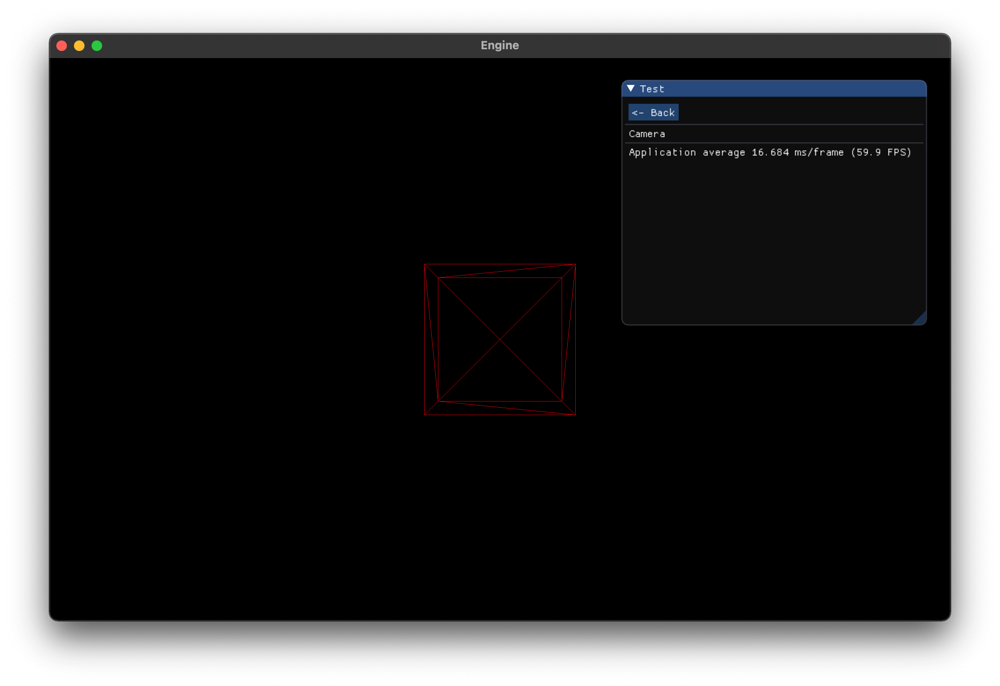

While this is purely a learning project and is definitely not finished, I am including this here to document my progress and provide the source code.

I picked up this project to learn graphics programming, particularly OpenGL, its graphics pipeline, vertex and index buffers, textures, vertex and fragment shaders w/ GLSL, as well as the 3D maths required for camera setup, transforms, translations and lighting. The solution uses GLAD as the OpenGL extension loader, GLFW for window management, GLM as the maths library, ImGUI for GUI and displaying information.

The application has three tests: solid color, 2D textures and a 3D model.

<small>Select color test.</small>

<small>Display 2D textures and translate test.</small>

<small>Display 3D object.</small>

