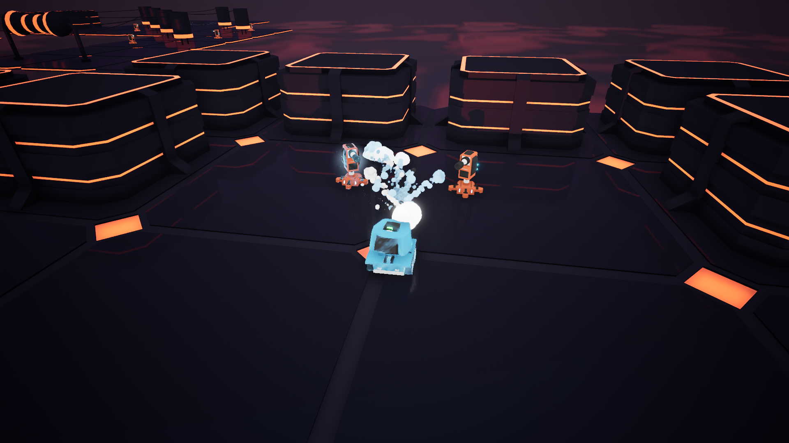
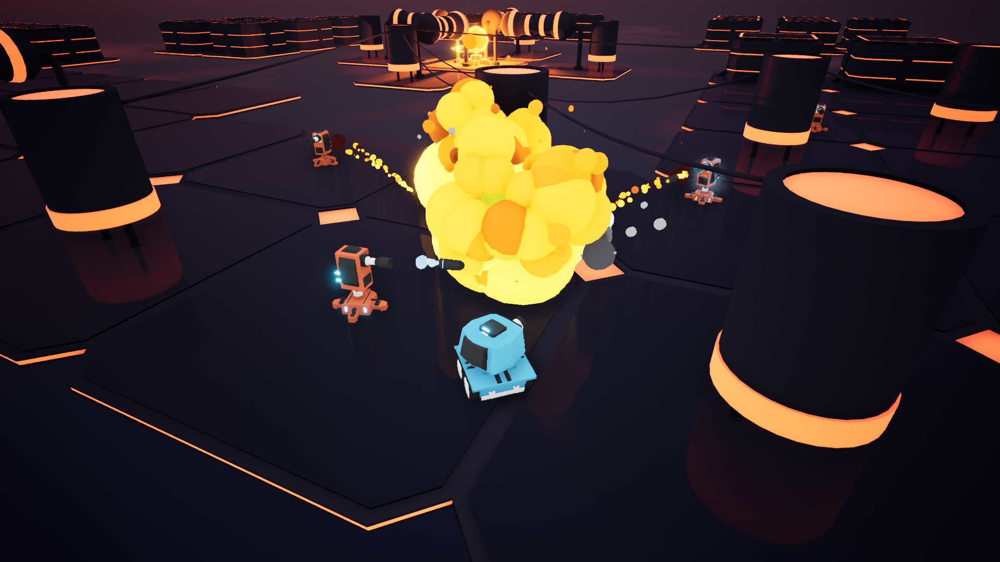
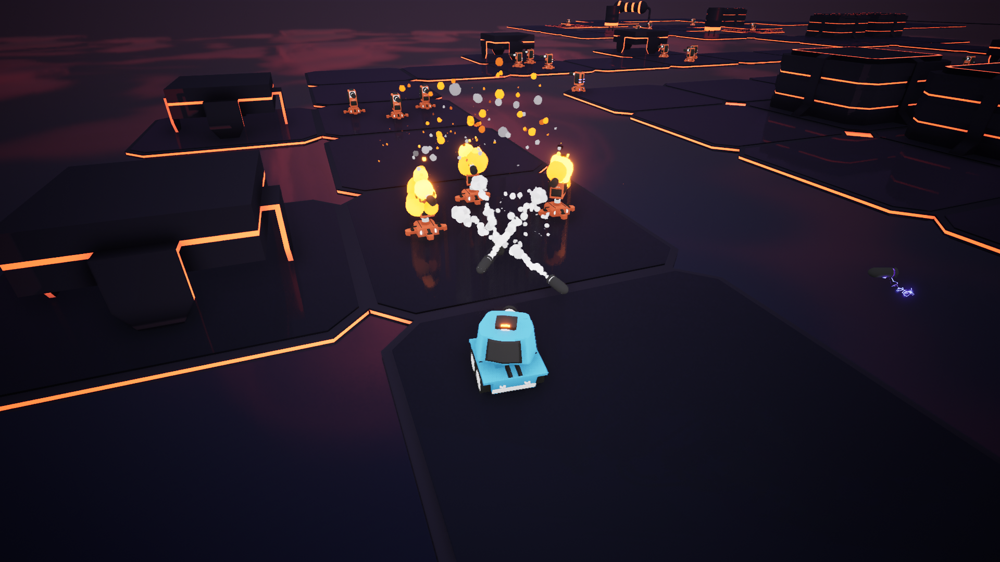
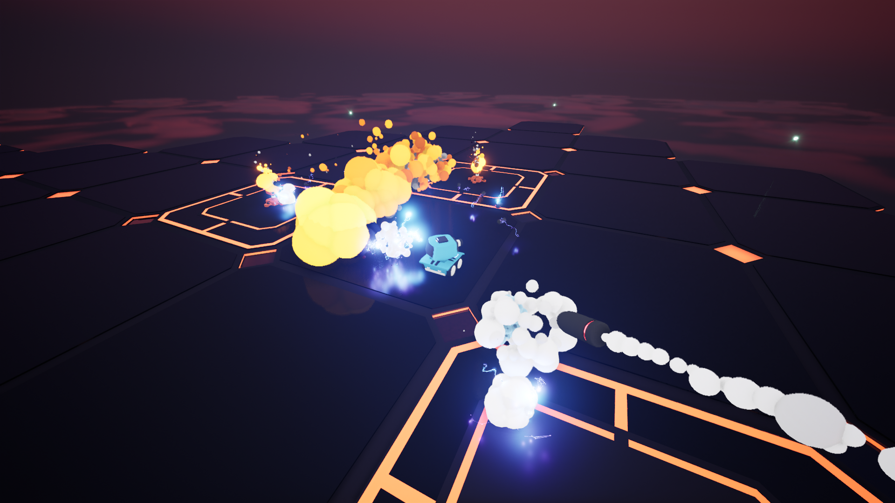
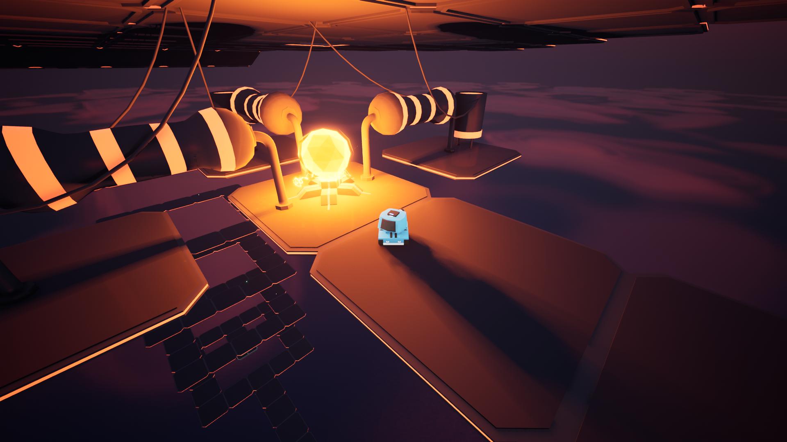

I’ve been working on this project and extending the game for quite some time now since I really got hooked on adding more and learning new things in Unreal Engine 5. I’m pleased to announce, ToonTanks: Circuit Clash! This feels like a complete game at this point. I think that it’s safe to say that I’ve learned a lot!

The game has several projectiles, custom particles and status effects, pickups, inventory, hand-made meshes and materials, main menu and settings, level streaming, loading screen, saving, 6 total levels and a boss battle.

### [-> Read my post about the development process.]()

### Trailer showcasing the gameplay



### Try it out on Itch.io

<iframe frameborder="0" src="https://itch.io/embed/2318899?linkback=true&amp;dark=true" width="100%" height="100%"><a href="https://icouldbreathe.itch.io/toontanks-circuit-clash">ToonTanks: Circuit Clash by icouldbreathe</a></iframe>

### Screenshots

#### #1

#### #2

#### #3

#### #4

#### #5

